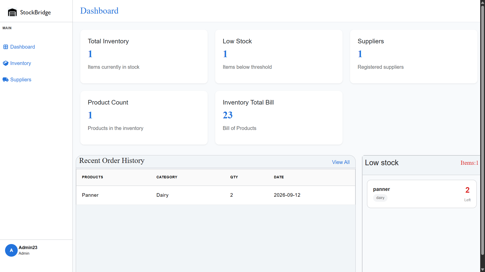
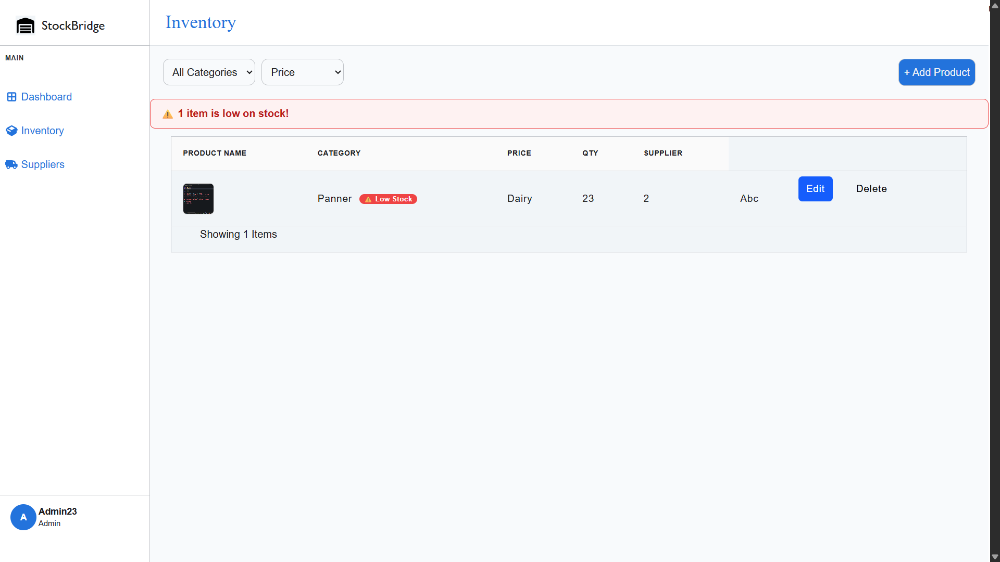
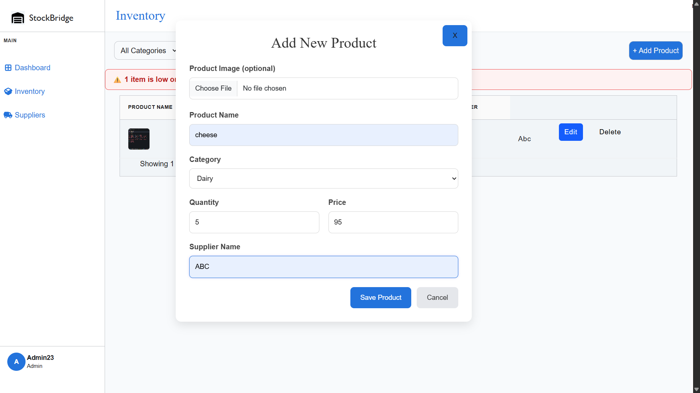

# StockBridge — Inventory Management System

A web-based inventory management system built for restaurants, cafes, and cloud kitchens to efficiently manage stock, track expiry dates, and monitor suppliers.

---

## Features

- User authentication (Sign up / Login / Logout)
- Add, edit, and delete products
- Product image upload
- Filter products by category and price
- Low stock alerts
- Supplier management
- Category management
- Search and filter inventory
- Expiry date tracking

---

## Tech Stack

| Layer        | Technology            |
| ------------ | --------------------- |
| Frontend     | HTML, CSS, JavaScript |
| Backend      | Node.js, Express.js   |
| Database     | MySQL                 |
| Image Upload | ImgBB API             |
| Hosting      | Render                |

---

## Setup Instructions

### Prerequisites

- Node.js (v18+)
- A free [ImgBB API key](https://api.imgbb.com)

### 1. Clone the repo and install dependencies

```bash
git clone https://github.com/aary0605/Inventory-Management.git
cd Inventory-Management
npm install
```

### 2. Configure environment variables

Create a `.env` file in the root directory:

```env
DB_HOST=your_mysql_host
DB_USER=your_mysql_user
DB_PASSWORD=your_mysql_password
DB_NAME=inventory
IMGBB_API_KEY=your_imgbb_api_key
```

### 3. Run the server

```bash
npm start
```

Open your browser at `http://localhost:8000`

---

## Screenshots

| SignUp | Login | Dashboard | Inventory | Add Product | Edit Product | Supplier | Add Supplier| Edit Supplier |
| | --------------------------------------- | ------------------------------------------- |
| ![SignUp] (screenshots/signup.png) | ![Login] (screenshots/login.png) |  |  |  | ![EditProduct] (screenshots/edit-product.png) | ![Supplier] (screenshots/supplier.png) | ![Add Supplier] (screenshots/add-supplier.png) | ![Edit Supplier] (screenshots/edit-supplier.png)|

> Add screenshots to a `/screenshots` folder in your repo to display them here.

---

## API Routes

### Auth

| Method | Route          | Description                     |
| ------ | -------------- | ------------------------------- |
| POST   | `/auth/signup` | Register a new user             |
| POST   | `/auth/login`  | Login and redirect to Dashboard |

### Inventory

| Method | Route                           | Description                 |
| ------ | ------------------------------- | --------------------------- |
| GET    | `/inventory/history`            | Get all products            |
| POST   | `/inventory/product`            | Add a new product           |
| PATCH  | `/inventory/edit`               | Edit an existing product    |
| DELETE | `/inventory/delete?id=`         | Delete a product by ID      |
| GET    | `/inventory/product/data?id=`   | Get a single product by ID  |
| GET    | `/inventory/category?category=` | Filter products by category |
| GET    | `/inventory/price?option=`      | Sort products by price      |

### Suppliers

| Method | Route                  | Description                |
| ------ | ---------------------- | -------------------------- |
| GET    | `/supplier/history`    | Get all suppliers          |
| POST   | `/supplier/add`        | Add a new supplier         |
| DELETE | `/supplier/delete?id=` | Delete a supplier          |
| PATCH  | `/supplier/data`       | Edit an existing Supplier  |
| GET    | `supplier/search?`     | Search Supplier By name    |
| GET    | `/supplier/sort?`      | Sort Supplier by Alphabets |

---

## Live Demo

[https://inventory-management-079j.onrender.com](https://inventory-management-079j.onrender.com)

> **Demo credentials:**
> Username: `Admin23`
> Password: `Admin1234`

---

## Author

**Patel Aary**
[GitHub](https://github.com/aary0605)
